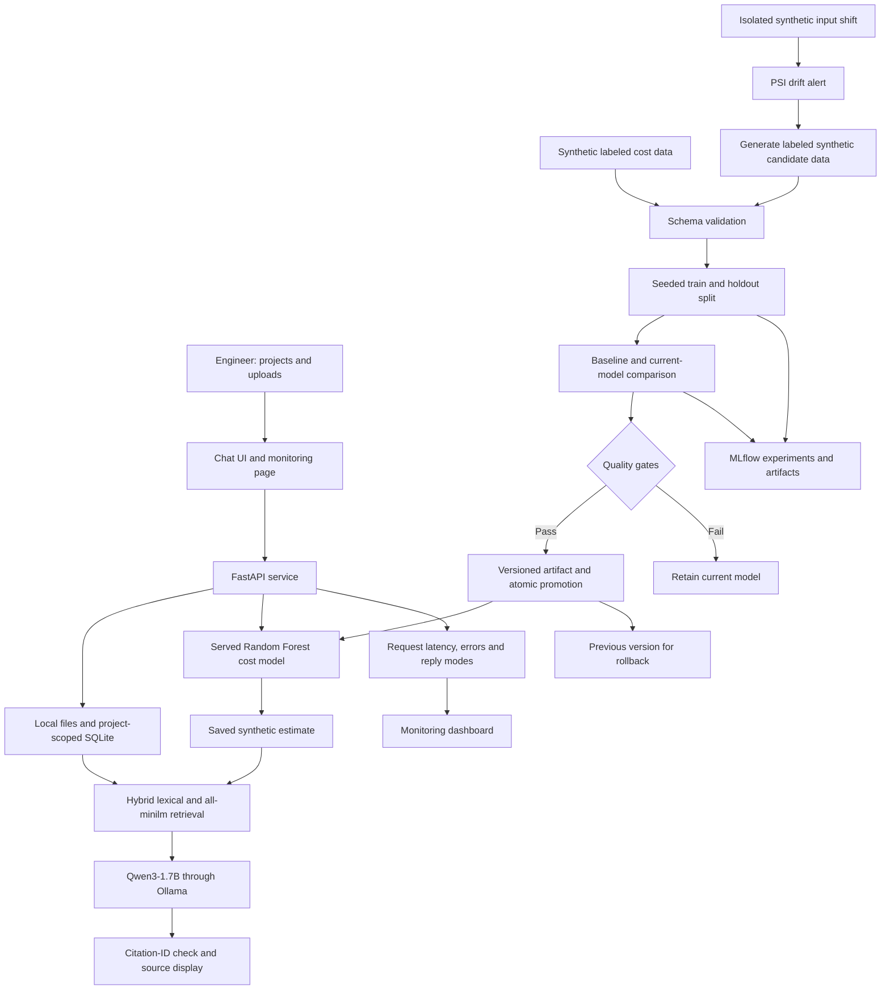

# ConstructAI — review demonstration

## One-minute explanation

ConstructAI lets a construction engineer manage separate project workspaces, upload project documents and ask questions in a chat interface. RAG retrieves evidence from the selected project and supplies it to a local Qwen3-1.7B foundation model. A Random Forest predicts costs from synthetic tabular data. MLflow records training and evaluation. A gated lifecycle validates data, compares candidates, promotes suitable models and supports rollback. Monitoring records service behavior and demonstrates input drift leading to retraining.

A separate Qwen3-0.6B LoRA experiment demonstrates supervised fine-tuning. Evaluation found citation weaknesses, so the adapter remains experimental. RAG does not train model weights; supervised fine-tuning does.

## Five-minute demo

1. Open the main application. Select a demo project, upload `sample-documents/riverside-report.txt`, ask **Who is the concrete supplier?**, and expand the source passage.
2. Use a separate project with `hillview-report.txt` and show that answers use only its files.
3. In **Project tools**, enter 3,000 square feet, three floors, quality 2, location factor 1, and 12 months. Generate a synthetic estimate and ask chat to explain it. Emphasize that this is an estimate, not actual spending.
4. Open **MLOps monitor**. Show the current cost model version and tracked MLflow run. Explain the baseline and current-model gates.
5. Show the drift demonstration: stable reference → changed synthetic inputs → PSI alert → labeled synthetic retraining → candidate gate → promotion → rollback. The demonstration has a separate registry, leaving the serving model unchanged.
6. Show the 12-question RAG evaluation: 10 full passes and two citation-related excerpt fallbacks. Show the automated checks report. Explain that the separately fine-tuned adapter was not promoted because evaluation found problems.

The prepared reports make the demo fast. To rerun the lifecycle live, use `python pipeline.py --drift-demo`; it takes longer than simply showing the saved results. Use the project Python environment described in README.md.

## Architecture

## Answers to likely questions

**What makes this MLOps?** Reproducible training; data/model hashes; real experiment tracking; candidate quality gates; versioned serving and rollback; service monitoring; an input-drift/retraining demonstration; automated tests and local deployment verification.

**What was trained?** A 120-tree bootstrapped CART forest on 2,000 synthetic rows, evaluated on 500 held-out rows. Separately, a rank-4 LoRA adapter on the last two attention layers of Qwen3-0.6B, using 24 synthetic examples for one epoch.

**Why two language models?** The normal chatbot uses the installed quantized 1.7B model. The smaller 0.6B model made the supervised-training experiment feasible on this laptop. We do not claim the default 1.7B was fine-tuned.

**What happens when a candidate is worse?** The gate rejects it and leaves the serving manifest unchanged. Tests verify baseline failure, regression failure and artifact-checksum failure. The adapter's non-promotion is a separate experimental evaluation decision.

**What does drift mean here?** The distribution of model inputs changed. A PSI threshold is a demo heuristic, not proof of inaccurate predictions. The isolated demo has synthetic labels available. Real retraining would require reviewed outcomes.

**Why only 10 of 12 RAG checks passed?** The factual/summary questions passed. In two missing-information cases the model omitted citation IDs, so the service returned labeled evidence excerpts. We report those as incomplete generation checks rather than claim perfect results.

**Are the metrics real?** The experiment measurements are real, but the data is synthetic. Cost R² of 0.9817 does not establish real construction forecasting accuracy. RAG checks are small and heuristic. The repeated synthetic holdout supports a demo rather than a final generalization claim.

**Is deployment complete?** The local Python service and shared CI check command have been run. The container definition and GitHub workflow are provided, but Docker and hosted CI have not run on this machine. This is not a cloud or production deployment.

**What is future work?** Expert-reviewed real datasets, larger unseen evaluations, actual cost feedback, access controls, backups, OCR/drawings, cloud deployment and infrastructure-scale monitoring.
